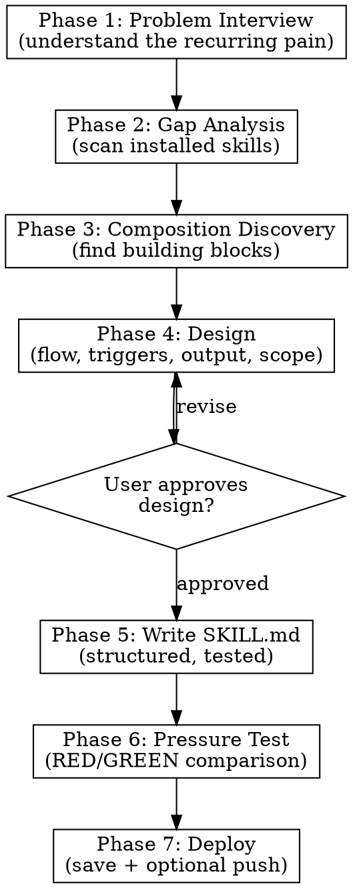

# SuperSkill Creator — Interactive Skill Builder

Build production-quality Claude Code skills through collaborative design, not mechanical generation.

<HARD-GATE>
Do NOT write any SKILL.md file until Phase 4 (Design) is approved by the user. Do NOT skip phases. Do NOT combine multiple phases into one message. Each phase produces a deliverable that the user reviews before proceeding.
</HARD-GATE>

## Philosophy

A skill is not a file — it's a solution to a recurring problem. Before writing a single line, you must:
1. Understand the problem deeply (not just the user's first description)
2. Know what already exists (gap analysis)
3. Know what building blocks to compose (discovery)
4. Design the flow with the user (not for the user)

## Phases



---

## Phase 1: Problem Interview

**Goal:** Understand the recurring problem the skill will solve.

**DO NOT** accept the first description as final. Dig deeper.

Ask these questions **one at a time** (not all at once):

1. **"What problem do you solve again and again?"**
   — The trigger: what situation keeps recurring?

2. **"When was the last time you hit this problem? What happened concretely?"**
   — Concrete recent example, not abstract description.

3. **"What did you do manually? What steps?"**
   — The manual workflow that the skill will automate/guide.

4. **"What result do you want? What does 'done' look like?"**
   — Output format: file? Message? Report? Code?

5. **"How often do you do this? Daily? Weekly?"**
   — Frequency determines complexity budget.

6. **"What should trigger this skill? What words/commands?"**
   — Trigger phrases for the description field.

**Deliverable:** 1-paragraph problem statement. Read it back to the user. Get confirmation.

**Anti-pattern:** "I understand, let me create the skill." — NO. Read back what you understood. User confirms or corrects.

---

## Phase 2: Gap Analysis

**Goal:** Check if an existing skill already solves this (fully or partially).

**Steps:**

1. **Scan installed skills:**
   ```bash
   ls ~/.claude/skills/ | sort
   ```
   Also check plugins:
   ```bash
   find ~/.claude/plugins/cache -name "SKILL.md" -o -name "skill.md" 2>/dev/null | head -50
   ```

2. **Read descriptions** of skills that might overlap. Use Grep:
   ```
   Grep for keywords from the problem statement across all SKILL.md files
   ```

3. **Report to user:**
   - "Found N installed skills. Here are the closest matches:"
   - For each match: name, what it does, **why it doesn't fully solve the problem**
   - If a skill DOES solve it: "This already exists: [skill]. Want to try it first?"

4. **Check external repos** (optional, if user wants):
   - Search GitHub for `claude-code skill [topic]`
   - Check awesome-claude-code lists
   - Search agentskills.io

**Deliverable:** Gap analysis table:

| Existing Skill | Overlap | Gap |
|---|---|---|
| skill-name | what it covers | what's missing |

**Gate:** If an existing skill covers >80% of the need, suggest extending it instead of creating new. Ask user.

---

## Phase 3: Composition Discovery

**Goal:** Identify existing skills to use as building blocks INSIDE the new skill.

**This is the key differentiator.** Most skill builders skip this entirely.

**Steps:**

1. Review the manual workflow from Phase 1
2. For each step, ask: **"Is there an existing skill that handles this step?"**
3. Check common categories:

   | Step Type | Look For |
   |---|---|
   | Web research | Skills that search HN, Reddit, Product Hunt, web |
   | Content generation | Skills that write copy, social posts, emails |
   | Data collection | Skills that gather analytics, scrape, parse |
   | Code/script writing | Skills that generate or review code |
   | Analysis | Skills that do market research, consulting analysis |
   | Platform-specific | Skills for YouTube, LinkedIn, Telegram, etc. |

4. **Present composition map to user:**
   ```
   Your new skill pipeline:
   Step 1: [manual/custom] — describe problem
   Step 2: [uses existing-skill-A] — fetch data
   Step 3: [uses existing-skill-B] — generate content
   Step 4: [custom] — compile output
   Step 5: [manual] — deliver result
   ```

5. For each composed skill: note whether to invoke via `Skill` tool or just reference its methodology.

**Deliverable:** Composition map with build-vs-reuse decisions.

---

## Phase 4: Design

**Goal:** Design the complete skill before writing it.

**Present to user for approval:**

### 4.1 Skill Identity
- **Name:** `kebab-case-name`
- **Trigger phrases:** (from Phase 1, question 6)
- **Description:** "Use when..." (triggers only, never workflow summary)

### 4.2 Pipeline Flow
- Numbered steps with inputs/outputs
- Which steps use subagents (parallel vs sequential)
- Which steps are interactive (need user input) vs autonomous

### 4.3 Output Specification
- File format and save location
- Notification format (if applicable)
- What the user sees at the end

### 4.4 Composition Points
- Which existing skills are composed in (from Phase 3)
- How they're invoked (Skill tool? Methodology reference? Subagent?)

### 4.5 Scope Guard
- What this skill does NOT do (explicit antigoals)
- When to use a DIFFERENT skill instead

**Deliverable:** Design document. User reviews and approves.

**Gate:** Do NOT proceed to Phase 5 without explicit user approval.

---

## Phase 5: Write SKILL.md

**Goal:** Write the skill file following best practices.

**Structure (mandatory):**

```markdown
---
name: skill-name
description: "Use when [triggers only, no workflow summary]"
---

# Skill Title

[1-2 sentence overview]

## Pipeline

[Numbered steps — the core of the skill]

## [Section per major phase]

[Details, instructions, templates]

## Common Mistakes

[Anti-patterns specific to this skill]
```

**Rules:**
- Description = triggering conditions ONLY, never workflow summary
- Start description with "Use when..."
- Keep description under 500 characters
- No narratives — reference guides and patterns
- Code examples: one excellent > many mediocre
- Flowcharts only for non-obvious decisions
- Subagent prompts: include full prompt text, not references

**Save to:** `~/.claude/skills/{skill-name}/SKILL.md`

Also save any supporting scripts (Python, bash) to the same directory.

---

## Phase 6: Pressure Test

**Goal:** Verify the skill adds value by testing WITHOUT it first (RED), then WITH it (GREEN).

**Approach:**

1. **Describe a realistic scenario** where the skill would be needed
2. **Ask user:** "Want me to run a quick test? I'll handle the scenario without the skill first, then with it. We compare."
3. If user says yes: launch a subagent WITHOUT the skill context, observe behavior
4. Compare: did the skill add value? What did the subagent miss without it?
5. If gaps found: iterate on SKILL.md

**Gate:** User confirms the skill works well enough. Perfection is not required — skills improve with use.

---

## Phase 7: Deploy

**Goal:** Save, verify, and optionally push to a remote repository.

1. Verify file saved to `~/.claude/skills/{skill-name}/SKILL.md`
2. Verify skill appears in the skill list (invoke it to check)
3. If user has a skills backup repo:
   - Copy skill files to repo
   - **Ask user:** "Push to GitHub?" — only push with explicit confirmation
4. Report: skill name, trigger phrases, file location

---

## Quick Reference

| Phase | Deliverable | Gate |
|-------|-------------|------|
| 1. Problem Interview | Problem statement | User confirms |
| 2. Gap Analysis | Overlap table | User decides: new vs extend |
| 3. Composition Discovery | Composition map | User reviews |
| 4. Design | Design document | User approves |
| 5. Write | SKILL.md file | Saved |
| 6. Pressure Test | Test results | User confirms |
| 7. Deploy | Saved + pushed | User confirms |

## Anti-Patterns

- **"Let me just create a quick skill"** — NO. Every skill goes through all phases.
- **Skipping Gap Analysis** — leads to duplicate/overlapping skills.
- **Not composing** — building from scratch what existing skills already handle.
- **Workflow in description** — Claude uses description to decide whether to load the skill body. If description contains workflow details, it may trigger incorrectly or be skipped.
- **Too many questions at once** — ONE question per message, always.
- **Writing before designing** — design is the product, SKILL.md is just the encoding.
- **Giant monolith skills** — if a skill does 5 unrelated things, it's 5 skills.
- **No scope guard** — without explicit "this skill does NOT do X", the skill creeps in scope over time.
